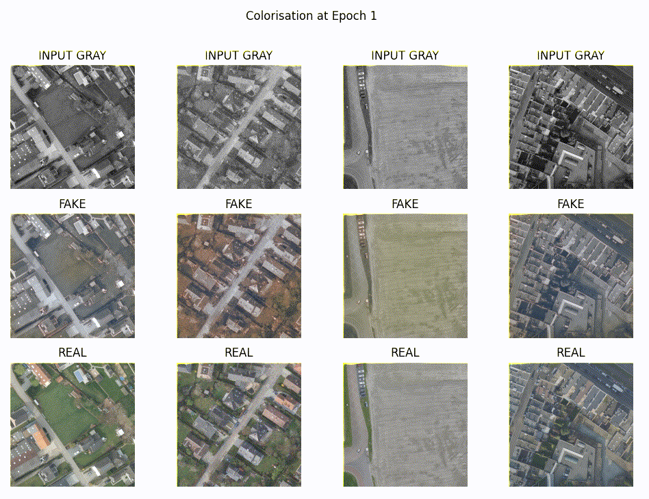

Orthophoto Colorisation with deeplearning
===========================

Deeplearing model to colorize historical black&white orthophotos(1).

(1): *An orthophotos is an aerial photograph geometrically corrected ("orthorectified") such that the scale is uniform. It is the basis for most mapping solutions.*

Background:
------------

The model was based on instructions found in [Colorizing black & white images with U-Net and conditional GAN][0] by *Moein Shariatnia* Published in *Towards Data Science*.
This example for ESRI where they generate fake a orthophoto from elevation, was also an inpiration for this model: [Generating rgb imagery from surface elevation using Pix2Pix][6]  
Both articles are based the original paper by Phillip Isola Et al.: [Image-to-Image Translation with Conditional Adversarial Networks][7]
 
But I made several changes to fit it to training en infering on older geospatial orthophoto's, like a specific augmentation function and reading data with [GDAL][1] a library that preserves geospacial metadata when reading data and offers several utilities to deal with geodata, unlike Pillow, torchvision or OpenCV.  

Source data 
-----------

I used the imagery produced by [Earth Observation Data Science (EODaS)][2] departement of the Flemish goverment as training data, these can be used and downloaded freely from [download.vlaanderen.be][3].

For testing with real older black&white orthophotos I used data obtained from Belgian Geverment, Departement of Defence, National Geographic Institute (NGI) 
These files can be purchased from their [website][4].

How I preprocessed them can be found in the first chapter of [exploration.ipynb](exploration.ipynb)

Pretraining 
-----------

In order to initialise the weigths of the generator, it can be pretrained by running a few image througth the unet without the discriminator, this should improve training speed. 

I used the script [pretrain_unet.py](pretrain_unet.py). 

Train 
------

The trainingscript select images from a apache Arrow-file in a weigthed fashion.  
To reduce memory use I use Half-precision floating-point tensors and I also use [Huggingface accelerate][5] to speed up training. This also allows us to train on multiple GPU's. 

To train for production you can use `accelerate launch .\trainWeigthed.py` to run the script with these options:

    -h, --help               show this help message and exit.
    --imsize IMSIZE          The size the input image will be resize to.
    --epochs EPOCHS          The number of epochs to train for.
    --train_size TRAIN_SIZE  The number of images to load from the training data.
    --lr_net_G LR_NET_G      Learing rate of the generator.
    --lr_net_D LR_NET_D      Learing rate of the discriminator.
    --dataset DATASET        Input traindata in Apache feather/arrow format.
    --dataset_path_field DATASET_PATH_FIELD
                             Fieldname to the path to the image.
    --dataset_weight_field DATASET_WEIGHT_FIELD
                             Fieldname to the weight of the image
    --pretrained_weights PRETRAINED_WEIGHTS
                             File that contains the pretrained weights.
    --output_weights OUTPUT_WEIGHTS
                             The filename and path to the output weights.
    --resume_from RESUME_FROM
                             Resume traings from these weights
    --resume_epoch RESUME_EPOCH
                             The epoch to resume from.

You can also change the values in CAPITAL-case in top of the script to your settings to change te default values. 

I trained the final model for 20 epoch's on 50000 images of 512x512 pixels with a ground resoltion between 0.3 and 1 meter. 

You can see the result for each epoch on this gif: 

Inference and testing
---------------------

The script to test inference is called `infer_test.py`. 
It allows tou to convert a GDAL-readable black&white source to colorized data. 
You can have multiple inputs by using glob expression (*.tif). 
Outputs are written to a [gdal-driver][8] that supports `create`, like Geotiff.
It preserves geo-spatial metadata, like crs and geotransform.  

Options:

    -h, --help          Show this help message and exit.
    --input INPUT       The input file(s), you can use a glob expression like "*.tif" to specify multiple files
    --out_dir OUT_DIR   The output location of the resulting colorisation, don't use the input folder!
    --out_driver OUT_DRIVER
                        The output gdal driver to use to write output, 
                        only drivers that support "create" can be used.
                        (see https://gdal.org/drivers/raster/)
    --batch_size BATCH_SIZE
                        the size of batch the algoritem sends to the GPU in 1 batch, 
                        If you get CUDA of of memory issues, try to decreaser the batch.

[0]: https://towardsdatascience.com/colorizing-black-white-images-with-u-net-and-conditional-gan-a-tutorial-81b2df111cd8
[1]: https://gdal.org/api/python/osgeo.gdal.html
[2]: https://www.vlaanderen.be/digitaal-vlaanderen/onze-oplossingen/earth-observation-data-science-eodas
[3]: https://download.vlaanderen.be/catalogus?thema=beelden-basiskaarten-grondgebruik&sort=4&q=orthofoto
[4]: https://www.ngi.be/website/aanbod/digitale-geodata/orthofotos/
[5]: https://huggingface.co/docs/accelerate/
[6]: https://developers.arcgis.com/python/samples/generating-rgb-imagery-from-digital-surface-model-using-pix2pix/
[7]: https://arxiv.org/abs/1611.07004
[8]: https://gdal.org/drivers/raster